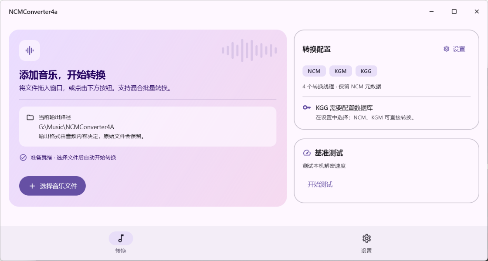
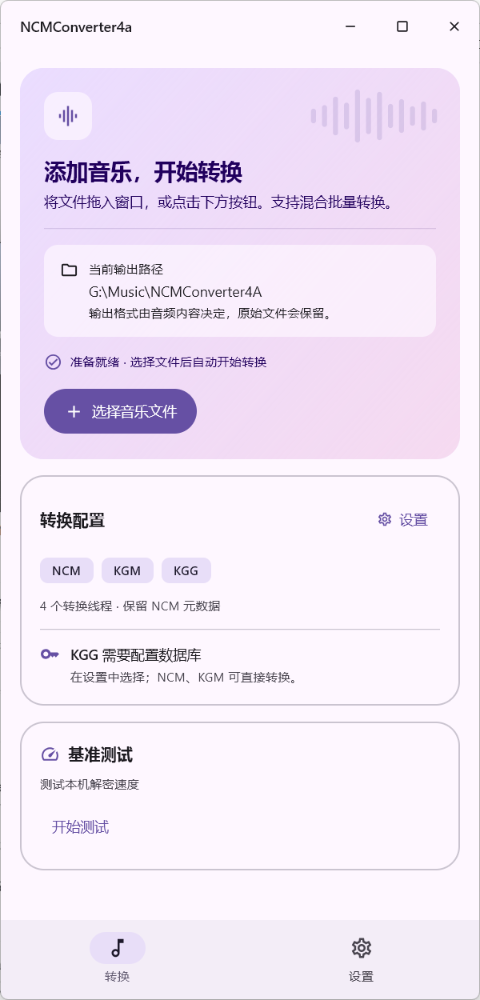

# NCMConverter4a

一个适用于安卓的歌曲转换器

### 程序界面

PC 端默认启动界面：

单列布局，供手机端界面参考：

单列截图来自 PC 端窄窗口，两张截图中的输出路径均为示例配置。

### 使用方法：
1.从右下角按钮选择文件 

2.从外部文件管理器选择文件分享至该软件

PS:上述方法均支持批量选择文件

3.在“设置 → 扫描目录”中配置 NCM、KGG、KGM 各自的目录，再到“扫描”页扫描子目录、勾选结果并批量转换。目录选择会在重启后保留。

Android 的 NCM 默认目录为 `/sdcard/Download/netease/cloudmusic/Music`，首次扫描时在系统目录选择器中授权该文件夹。KGG 和 KGM 暂无默认目录，需要自行选择。扫描按文件扩展名匹配，支持大小写。

NCM 文件可解密为 MP3、FLAC 或 M4A。M4A 会保留原有的 MP4 容器和已有标签，不会从 NCM 头部补写标签。

### 设置说明：
1.原始写入模式：开启后软件仅进行解密，不进行写入元数据操作（只适用于NCM文件，因为KGM文件根本没提供元数据）

2.线程数滑条：调整转换时使用的线程数量

3.PC 端输出文件夹：在“设置”中选择输出文件夹，NCM、KGM、KGG 转换后的音频统一保存到所选目录。默认使用用户目录下的 `Music/NCMConverter4A`，选择会在重启后保留。

### 免责声明：
本项目仅用于学习用途，请确保您已充分了解相关版权协议，否则请勿使用。
### 代码参考
taurusxin/ncmdump; charlotte-xiao/NCM2MP3; anonymous5l/ncmdump; unlock-music/unlock-music

#### DeepWiki链接

